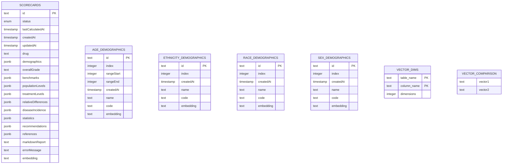

# Database Documentation

## Overview

The database is designed to store and manage diversity scorecard data for clinical trials. It uses PGlite for client-side storage and includes support for vector operations to enable semantic search and similarity comparisons.

## Entity Relationship Diagram



## Vector Support Architecture

The system implements a hybrid approach for vector operations:

1. **Storage Format**: Vectors are stored as comma-separated strings of numbers in the database using a custom `vector` domain type.

2. **Vector Operations**:
   - Client-side operations (JavaScript):
     - Vector normalization
     - Cosine similarity calculation
     - Vector addition/subtraction
     - L2 distance calculation
     - Random vector generation
   - Database operations (PGlite):
     - Vector similarity search using `<=>` operator
     - Vector comparison caching
     - Dimension tracking

3. **Performance Optimizations**:
   - Cached similarity scores in `vector_comparison` table
   - Indexed vector operations for fast similarity search
   - Dimension validation through `vector_dimensions` table

## Table Descriptions

### Scorecards

The main table storing diversity scorecard data.

| Column | Type | Required | Key | Description |
|--------|------|----------|-----|-------------|
| id | text | Yes | PK | UUID primary key |
| status | enum | Yes | - | Current status: draft/calculating/complete/error |
| lastCalculatedAt | timestamp | No | - | When the scorecard was last calculated |
| createdAt | timestamp | Yes | - | Creation timestamp |
| updatedAt | timestamp | Yes | - | Last update timestamp |
| drug | text | Yes | - | Name of the drug being evaluated |
| demographics | jsonb | No | - | Demographic data for sex, age, race, ethnicity |
| overallGrade | text | No | - | Overall diversity grade |
| benchmarks | jsonb | No | - | Benchmark values for each demographic category |
| populationLevels | jsonb | No | - | Population representation levels |
| treatmentLevels | jsonb | No | - | Treatment effectiveness levels |
| relativeDifferences | jsonb | No | - | Relative differences in outcomes |
| diseaseIncidence | jsonb | No | - | Disease incidence data |
| statistics | jsonb | No | - | Statistical analysis results |
| recommendations | jsonb | No | - | Improvement recommendations |
| references | jsonb | No | - | Reference citations |
| markdownReport | text | No | - | Generated markdown report |
| errorMessage | text | No | - | Error message if status is 'error' |
| embedding | text | No | - | Vector embedding for semantic search |

### Age Demographics

Stores age range demographic categories.

| Column | Type | Required | Key | Description |
|--------|------|----------|-----|-------------|
| id | text | Yes | PK | UUID primary key |
| index | integer | Yes | - | Sort order index |
| rangeStart | integer | No | - | Start of age range |
| rangeEnd | integer | No | - | End of age range |
| createdAt | timestamp | Yes | - | Creation timestamp |
| name | text | Yes | - | Display name |
| code | text | Yes | - | Unique code identifier |
| embedding | text | No | - | Vector embedding for semantic search |

### Ethnicity Demographics

Stores ethnicity demographic categories.

| Column | Type | Required | Key | Description |
|--------|------|----------|-----|-------------|
| id | text | Yes | PK | UUID primary key |
| index | integer | Yes | - | Sort order index |
| createdAt | timestamp | Yes | - | Creation timestamp |
| name | text | Yes | - | Display name |
| code | text | Yes | - | Unique code identifier |
| embedding | text | No | - | Vector embedding for semantic search |

### Race Demographics

Stores race demographic categories.

| Column | Type | Required | Key | Description |
|--------|------|----------|-----|-------------|
| id | text | Yes | PK | UUID primary key |
| index | integer | Yes | - | Sort order index |
| createdAt | timestamp | Yes | - | Creation timestamp |
| name | text | Yes | - | Display name |
| code | text | Yes | - | Unique code identifier |
| embedding | text | No | - | Vector embedding for semantic search |

### Sex Demographics

Stores sex demographic categories.

| Column | Type | Required | Key | Description |
|--------|------|----------|-----|-------------|
| id | text | Yes | PK | UUID primary key |
| index | integer | Yes | - | Sort order index |
| createdAt | timestamp | Yes | - | Creation timestamp |
| name | text | Yes | - | Display name |
| code | text | Yes | - | Unique code identifier |
| embedding | text | No | - | Vector embedding for semantic search |

### Vector Dimensions

Tracks vector dimensions for embedding columns.

| Column | Type | Required | Key | Description |
|--------|------|----------|-----|-------------|
| table_name | text | Yes | PK | Name of the table containing vectors |
| column_name | text | Yes | PK | Name of the vector column |
| dimensions | integer | Yes | - | Number of dimensions in the vector |

### Vector Comparison

Temporary table for vector similarity calculations.

| Column | Type | Required | Key | Description |
|--------|------|----------|-----|-------------|
| vector1 | text | No | - | First vector for comparison |
| vector2 | text | No | - | Second vector for comparison |

## Implementation Notes

1. **Client-side Vector Operations**:
   - Vector operations are implemented in JavaScript for flexibility and to reduce database load
   - The `vector-utils.ts` module provides core vector manipulation functions
   - The `useVectorOps` hook provides database integration for vector operations

2. **Type Safety**:
   - Vector type is defined as a string with comma-separated numbers
   - TypeScript interfaces ensure type safety across the application
   - Runtime validation ensures vector dimension consistency

3. **Performance Considerations**:
   - Similarity scores are cached to avoid recalculation
   - Batch operations are used for vector comparisons
   - Indexes optimize similarity searches

## Initial Setup

To set up a new database:

1. Create a new PostgreSQL database
2. Enable the vector extension:
   ```sql
   CREATE EXTENSION vector;
   ```
3. Run the initial migration to create tables
4. Seed the demographic tables with initial data
5. Create indexes for vector similarity search:
   ```sql
   CREATE INDEX ON scorecards USING ivfflat (embedding vector_cosine_ops);
   CREATE INDEX ON age_demographics USING ivfflat (embedding vector_cosine_ops);
   CREATE INDEX ON ethnicity_demographics USING ivfflat (embedding vector_cosine_ops);
   CREATE INDEX ON race_demographics USING ivfflat (embedding vector_cosine_ops);
   CREATE INDEX ON sex_demographics USING ivfflat (embedding vector_cosine_ops);
   ```

## Usage Notes

- All IDs are UUIDs stored as text
- Timestamps are stored with timezone information
- JSON fields use strict TypeScript types for type safety
- Vector embeddings are used for semantic search and similarity comparisons
- The status enum ensures scorecards follow a valid lifecycle
- Indexes are automatically created on primary keys and vector columns

## Best Practices

1. Always normalize vectors before storage
2. Cache similarity scores for frequently compared vectors
3. Validate vector dimensions before operations
4. Use batch operations for multiple vector comparisons
5. Implement proper error handling for vector operations 