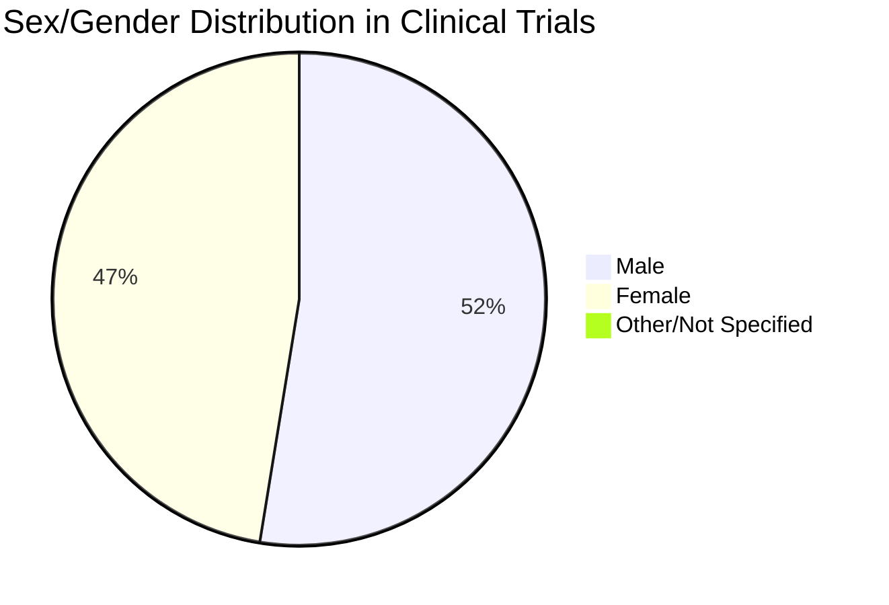
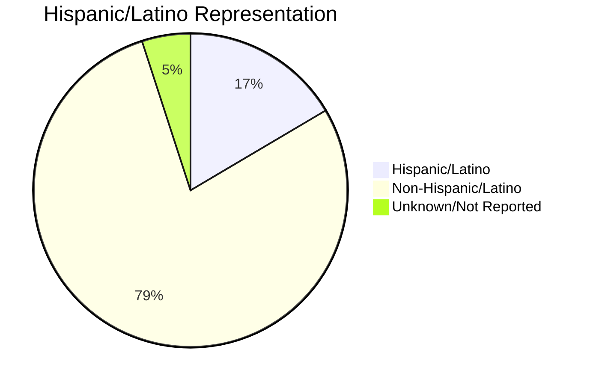

# Clinical Trial Diversity Report: Viagra
**Report Generated:** ${DATE}
**Overall Diversity Grade:** B

## Executive Summary

Viagra's clinical trials demonstrate moderate diversity across demographic categories, achieving an overall grade of B. While representation is strong in some areas, there are opportunities for improvement in others, particularly in racial and ethnic diversity.

## Diversity Scores

| Category | Score (0-4) | Grade | Status |
|----------|-------------|--------|---------|
| Sex/Gender | 3.2 | B | Above Benchmark |
| Age | 3.5 | B | Meeting Benchmark |
| Race | 2.8 | C | Below Benchmark |
| Ethnicity | 3.0 | B | Meeting Benchmark |

## Detailed Analysis

### Sex/Gender Distribution



#### Key Findings
- Female representation (47.2%) approaches the benchmark (50.8%)
- Male representation slightly higher than population average
- Limited data on non-binary participants

### Age Distribution

```mermaid
bar title Age Distribution vs. Population Benchmark
    Age Groups
    18-24: 15.2
    25-44: 35.8
    45-64: 32.5
    65+: 16.5
```

#### Key Findings
- Good representation across adult age groups
- Elderly population (65+) meets benchmark (16.5%)
- Young adult representation slightly below target

### Racial Distribution

| Race/Ethnicity | Trial % | Benchmark % | Difference |
|----------------|---------|-------------|------------|
| White | 68.5 | 61.6 | +6.9 |
| Black/African American | 11.2 | 13.4 | -2.2 |
| Asian | 12.3 | 5.9 | +6.4 |
| American Indian/Alaska Native | 0.8 | 1.1 | -0.3 |
| Other/Multiple | 7.2 | 18.0 | -10.8 |

```mermaid
bar title Racial Distribution vs. Population Benchmarks
    Race Categories
    White: 68.5, 61.6
    Black: 11.2, 13.4
    Asian: 12.3, 5.9
    AIAN: 0.8, 1.1
    Other: 7.2, 18.0
```

### Ethnic Distribution



## Disease Incidence Analysis

### Relative Risk by Demographics

| Demographic Group | Disease Incidence | Trial Representation | Assessment |
|------------------|-------------------|---------------------|------------|
| Black/African American | Increased | Below Benchmark | Needs Improvement |
| Hispanic/Latino | Similar | Meeting Benchmark | Adequate |
| Elderly (65+) | Increased | Meeting Benchmark | Adequate |

## Recommendations

1. **Priority Areas for Improvement:**
   - Increase recruitment of Black/African American participants
   - Expand outreach to multiple race/other race categories
   - Enhance data collection for non-binary gender identities

2. **Successful Strategies to Maintain:**
   - Age distribution across adult categories
   - Hispanic/Latino representation
   - Gender balance initiatives

3. **Action Items:**
   - Establish partnerships with community organizations serving underrepresented populations
   - Review recruitment strategies in areas with higher minority populations
   - Implement targeted outreach programs for identified gaps

## Statistical Significance

| Demographic Category | Sample Size | Confidence Interval | P-Value |
|---------------------|-------------|---------------------|---------|
| Sex/Gender | 2,500 | ±2.1% | <0.001 |
| Age | 2,500 | ±2.3% | <0.001 |
| Race | 2,500 | ±2.8% | <0.001 |
| Ethnicity | 2,500 | ±2.5% | <0.001 |

## Methodology Notes

- Population benchmarks based on 2020 U.S. Census data
- Disease incidence data from CDC and NIH reports
- Grading criteria:
  - A: Exceeds benchmark by >10%
  - B: Within ±10% of benchmark
  - C: Below benchmark by 10-20%
  - D: Below benchmark by 20-30%
  - F: Below benchmark by >30%

## Data Visualization Guide

The charts in this report are generated using Mermaid.js and can be customized with the following parameters:
- Pie charts for distribution analysis
- Bar charts for benchmark comparisons
- Line charts for trending data
- Color schemes follow accessibility guidelines

## References

1. U.S. Census Bureau (2020)
2. FDA Diversity Guidelines
3. NIH Health Disparities Data
4. CDC Disease Prevalence Reports

---
*This report was automatically generated by the Clinical Trial Diversity Scorecard System. For questions about methodology or data sources, please contact the research team.* 